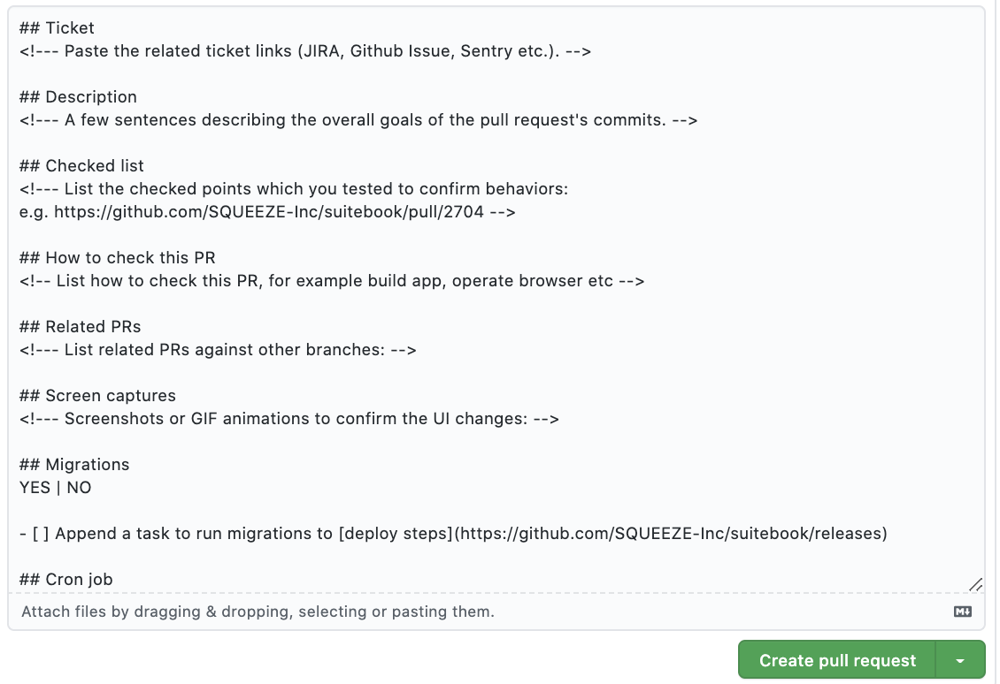
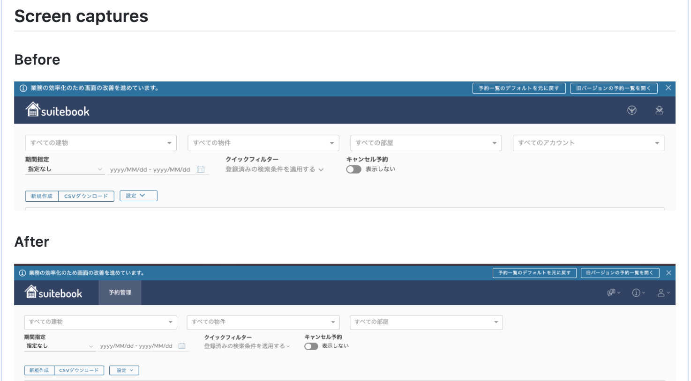
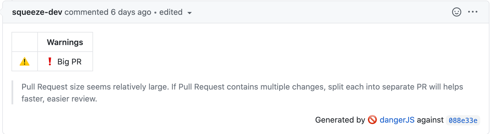
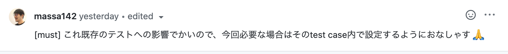
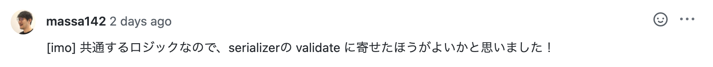
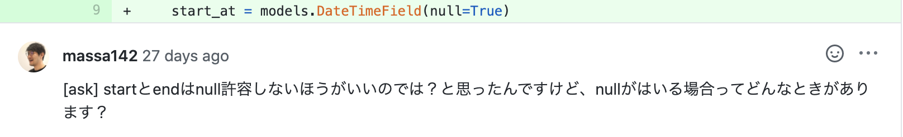

<!-- _class: invert -->
<!-- _paginate: false -->

# PythonistaのためのコードレビューTips

### Python Charity Talks in Japan

#### 2020/07/04 | Masataka Arai


----

## お前誰よ?


* Masataka Arai [@massa142][1]
* [SQUEEZE Inc.][2]
* [Pythonもくもく会][3] 主催
* [DjangoCongress JP][5] Staff
* [Python Boot Camp][6] 講師

[1]: http://massa142.github.io/
[2]: https://squeeze-inc.co.jp/
[3]: https://mokupy.connpass.com/
[5]: https://djangocongress.jp/
[6]: https://www.pycon.jp/support/bootcamp.html

----

普段チームで開発している人 🙋

----

コードレビューをしている/受けている人 🙋

----

大事なのはわかっているけど、意外と難しいコードレビュー

* 「シングルクオートに統一してください」「importの順番を整えてください」といった本質的ではない指摘
* diffが多すぎてレビューしづらいPR
* レビューコメントが厳しくて、チーム内の雰囲気が不穏に
* レビューのなかで長い議論が発生してしまって、コメント数だけが増えていくPR
* 溜まっていく未レビューPRたち
* レビューおじさん爆誕問題


----

この発表では、Pythonistaが明日から使えるコードレビューtipsを紹介していきます。

多くはSQUEEZE社内で日常的に行われているものを取り上げています。

----

お断り

* Python要素少なめでお届けします
* 自分がWebの人なので、アプリケーション開発の文脈が多いです

----

## 目次
- Style Guide / Formatter
- Dependabot
- Pull Requestの書き方
- Pull Requestのサイズ
- レビューコメントの書き方
- 議論が長くなった場合の対応
- モブレビューのすすめ
- コメントに遊び心を
- まとめ

----

<!-- _class: invert -->

# Style Guide / Formatter


----

# 現場あるある1

* 「シングルクオートに統一してください」
* 「importの順番を整えてください」
* 「ここは改行いれるほうが読みやすいと思う」

----


この問題について、naoyaさんがちょっと昔にブログで語っていました。

[些末なコードレビュー - naoyaのはてなダイアリー](https://naoya-2.hatenadiary.org/entry/20140313/1394664578)

----

> コードレビューに慣れないチームが、何の考えもナシにコードレビューを始めるととにかく気になったこと大小様々な指摘が行われることになる。
 一見、いろいろな指摘が出て議論が活発になっているように見えるが、だいたい議論が紛糾しているのは「コードのインデント幅が違う」とか「return が省略されてる。俺は return があったほうが好み」とか「その場合は字下げをした方が綺麗にみえるんでは」とか、そんな些末なことばかりである、ということが多い。必ず一度は通る道である。


----

> そんなことを延々議論していたって、はっきり言って何の意味もない。何の意味もない、は言い過ぎにしても、そんなところを改善したところで実質的な品質は何ひとつ上がらないわけだし、どうしても揃えたいなら lint ツールか何かで機械的にチェックすればよいことであって人間がやることではない。


----

> やらなければいけないのは、「その設計は拡張に対して開いていないから開くべき」とか「これではエッジケースが想定されていないからこういう不具合につながるのでは」とか「そのテストでは後日見返したときに第三者が要求仕様を解釈しづらい」とかそういう指摘である。
これらはちゃんとコードを読んで、コードの構造を把握して、そこに書かれているコード以外のシステムの全体感が頭に入っていて、初めてできる指摘である。

----

ここで大事なのは、

* Style GuideによるLint / 自動整形は機械がやる
* それ以外のコードレビューは人間がやる

という分業。

人間が使える時間は有限なので、できることは自動化していきましょう。

----

## Style Guide

* チームで決めておくと、各自の好みによる宗教戦争を防げる
* 属人性の排除
* PythonにはStyle Guideである[PEP8](https://www.python.org/dev/peps/pep-0008/)があるので、これをベースにしていけばOK
* [Google Python Style Guide](https://github.com/google/styleguide/blob/gh-pages/pyguide.md)や[Plone style guides](https://docs.plone.org/develop/styleguide/python.html)なども参考になるよ

----

## Style Guide

 🚨注意点

* flake8といったLintツールや次で紹介するFormatterで検知できないルールは作らないほうがよい

ex) `assertEqual(A, B)` のAには期待値を、Bには実際値を渡しましょう
* 自動的に検知できないものは結局人によるレビューが発生するので、ルールにするにしてもマストではなく推奨という温度感がオススメ

----

## Formatter

コードを自動整形してくれるツール

* [autopep8](https://github.com/hhatto/autopep8)
* [Black](https://github.com/python/black)
* [YAPF](https://github.com/google/yapf)


----

## Formatter

* Blackが新しくてIDEサポートも厚くて最近人気がある
* それぞれ特色があるから好みにあわせて選べばOK
* git hooksのpre-commitに設定しておくと捗る


参考記事
* [これで決まり！最強自動コード整形ツール3選！ - ばいばいバイオ](https://www.kimoton.com/entry/20181223/1545540702)
* [autopep8 version 2.0を目指して | hexacosa.net](https://www.hexacosa.net/blog/detail/194/)

----

<!-- _class: invert -->

# Dependabot

----

# 現場あるある2

* 依存packageの更新がしばらく放置されてしまってる
* まとめて対応しようとすると、影響範囲が広くなって確認が大変


----

# Dependabot

* requirements.txtをもとに依存パッケージの更新を定期的にチェックして、更新があった際にPull Requestを自動で作ってくれる

* パッチバージョンの更新の場合はauto mergeといった設定も可能
* 更新があったら向こうからpushしてくれる運用はよい
* 他の同様なツールとしては、[Renovate](https://renovate.whitesourcesoftware.com/)や[PyUp](https://pyup.io/)などがある

----

<!-- _class: invert -->

# Pull Requestの書き方

----

# 現場あるある3

* どこを修正したのかの説明がなくてレビューしようと思っても、取っ掛かりがつかみづらい
* UIに変更があるけど、どういった変更かはローカルで確認してみないとよくわからない

----

## PRの書き方のルールを設ける

* PULL_REQUEST_TEMPLATE.md
* フォーマットを設けることで、レビューに必要な情報を最低限揃えることができる


----

SQUEEZEで使ってるPRテンプレート




----

* チケットURL
* どういった内容の修正か
* PR提出前にローカルで確認したチェックリスト
* 関連するPR
* UIの変更がわかるスクショ or Gifアニ
* migrationファイルがあるか
* cron設定に変更があるか
* 依存パッケージの変更があるか


----

スクショ / Gifアニの添付

* どういった変更かがぱっと見でわかるからオススメ 




----

スクショ / Gifアニの添付

* BackstopJS, storybookなどを用いてリグレッションテスト・スナップショットの自動化までできればベターかも

（これの運用コストやプロダクトの性質を考慮したうえで）

----

<!-- _class: invert -->

# Pull Requestのサイズ

----

# 現場あるある4

* 「ふぇぇ、diffめっちゃ多くてレビュー無理だょぉ……」
* 「せっかくPR出してもらってけど、設計から見直したほうがいいかも」
  * レビューに時間かかる & その手戻り対応にも時間かかる
* レビューすべきポイントが多すぎて、防げるバグを見落としてしまう


----

# PRは細かく分割しよう

* 「PRの数が多くなると、その分レビューする回数が増えて時間かかるから反対」という声もあるけど、1つのレビューにかかる時間 & 手戻りが発生した場合を考えると大きいPR1つのほうが時間かかることも
* PRを細かくしたほうが責務が明確になることもあってレビューしやすい

----

## Dangerによるdiffチェック

* [Danger](https://danger.systems/): CI上で実行してPull requestをチェックし、コメントを残したりテストを失敗させたりできるツール




----

dangerfile.js

```js
// Warn when PR size is large
const bigPRThreshold = 350;
if (danger.github.pr.additions + danger.github.pr.deletions > bigPRThreshold) {
  warn(':exclamation: Big PR');
  markdown('> Pull Request size seems relatively large. If Pull Request contains multiple changes, split each into separate PR will helps faster, easier review.');
}
```

----

## WIPの活用

* Work In Progress
* すべてを実装する前に、設計や方針に問題ないかをレビューしてもらうために途中でいいからWIP PRを作成する
* レビューによる手戻りが大きくなることを防げる
* 作業過程のオープン化にもつながるのでオススメ

----

# Working Out Loud

* 作業が途中であってもチームメンバーの目の触れる場所にガンガンアウトプットする
* 作業で詰まったらとにかく尋ねる

=> WIP PR以外にも、作業ログや思考の垂れ流しをSlackで発信していくのおすすめ

参考記事
* [Working Out Loud 大声作業（しなさい）、チームメンバー同士でのトレーニング文化の醸成 - Quipper Product Team Blog](https://quipper.hatenablog.com/entry/2018/11/14/working-out-loud)


----

<!-- _class: invert -->

# レビューコメントの書き方

----

# 現場あるある5

* 「ここはxxxしたほうがよさそう」
  * この修正は必ずしたほうがいいのか、実装者の判断に委ねられているのかレビューコメントの意図がわからない
* テキストベースのコミュニケーションは難しい
  


----

## コメントにラベルをつける


* must: 必ず修正する必要あり
* imo: 自分ならこうするけどどう? (In my opinion)
* nits: typoなど細かい指摘
* ask: 質問

コメントの意図が明確になるので、リリースが迫っていてスピードが大事な場合などは、[must]だけの対応をして、[nits]や[IMO]の修正をあとにまわすといった判断が可能に

参考: [無理をしないコードレビュー - クックパッド開発者ブログ](https://techlife.cookpad.com/entry/2018/06/19/110000#f-80a41656)

----

### must



### imo



### ask




----

## [ask] を使った質問

* 何をしているかよくわからないコードにはどんどん質問していくといい
* 質問に答えることで実装の漏れに気づいたり、チームが知らなかったことの共有につながる
* [ask] ラベルがあることで気軽に質問しやすくなる


----

<!-- _class: invert -->

# 議論が長くなった場合の対応

----

# 現場あるある6

* テキストベースで会話してるけど、なんだか話がかみあってない...
* レビューがきっかけでアツい議論が発生してしまって、コメントだけ増えていってPRマージできない


----

## 対面で話し合おう

* テキストベースでのコミュニケーションは難しい
* なんだか噛み合ってない・話したほうがはやいと判断したら、テキストではなくコードを見ながら話し合おう
  * その場にいるなら席にいって話しかければOK
  * ZoomやSlack Callで画面共有しながら話すのもオススメ

----

## Issueに逃がす

* 議論が長くなったけど重要・緊急度が高くないものは、Issueに逃がすとよい
  * 「長くなったので続きはIssueでやりましょう。一旦このPRではA案で進めていきます」

* 議論が起こること自体は歓迎しよう
  * チームの組織力向上 / 文化の醸成につながる


----

<!-- _class: invert -->

# モブレビューのすすめ

----

# 現場あるある7

* 「とはいえ、レビューって後回しになっちゃうよね。自分のチケットやらないといけないしー」

* 増え続ける未レビューのPRたち

----

# モブレビューのすすめ

* モブプログラミングのレビュー版

> モブプログラミングの「モブ」とは群衆のことです。モブプログラミングでは、ペア（2人）ではなく、モブ（チーム全体）でプログラミングを行います。モブの人数は3人から5人くらいを想定しています。

ref: [WEB+DB PRESS Vol.102｜技術評論社](http://gihyo.jp/magazine/wdpress/archive/2018/vol102)


----

# モブレビューのすすめ

* みんな集まってガッとレビューしようぜっていうノリ
* レビューおじさん問題の解消につながる
* 実装者がモブのなかにいると意図もサクッと聞けて捗る
* 他の人がどういう観点でレビューしているかがわかって、ナレッジの共有にもつながる

----


----

<!-- _class: invert -->

# コメントに遊び心を

----

# 現場あるある8

* 「いいと思います」「ここ直してください」
  * 文字だけだと感情が見えてこない
  * 冷たい 楽しくない
  * 怒ってるのかな？といった誤解につながりやすい


----

# コメントに遊び心を

* 画像
* emoji
* ！！！

をどんどん使って感情を乗せていこう！！！

----

## LGTM画像


----

## emoji


* 褒めるの大事!!! < 忘れがちだけど本当にやったほうがいい


----

<!-- _class: invert -->

# まとめ

----

* 自動的にチェック・直せるものは機械に任せる
* レビュイーはレビューしやすいPRを提出する
* レビュアーは誤解なくレビューの意図を伝える


=> メンバーへの愛をもって、本質的なレビューに取り組もう

----

よりよいコードレビューを通じて、
`Readability counts.` なコードを育てていこうな ( ･ㅂ･)و ̑̑ ｸﾞｯ!

----

ご静聴ありがとうございました 😊

----

<!-- _class: invert -->

# 時間が余ったら

----

細かくPR区切っていた場合、
いつmasterにマージすべきかという問題が残る


----

## featureブランチ

* 開発期間がのびるとrebaseやmergeで苦しむのが見える
* 複数のfeatureブランチが発生した場合なかなかカオス
* 結局masterへのマージが巨大になってリリースに注意が必要

----

## featureフラグ

* ユーザーに影響がない・目に見えないものであれば、どんどんmasterにマージしてリリースしていくのがいいと思ってる
* 他の人が最新のコード状態を追いやすい
* もしユーザーの目に見える変更があればfeatureフラグで出し分けしたり、正式リリースまで隠しておく


----

ご静聴ありがとうございました 😊

