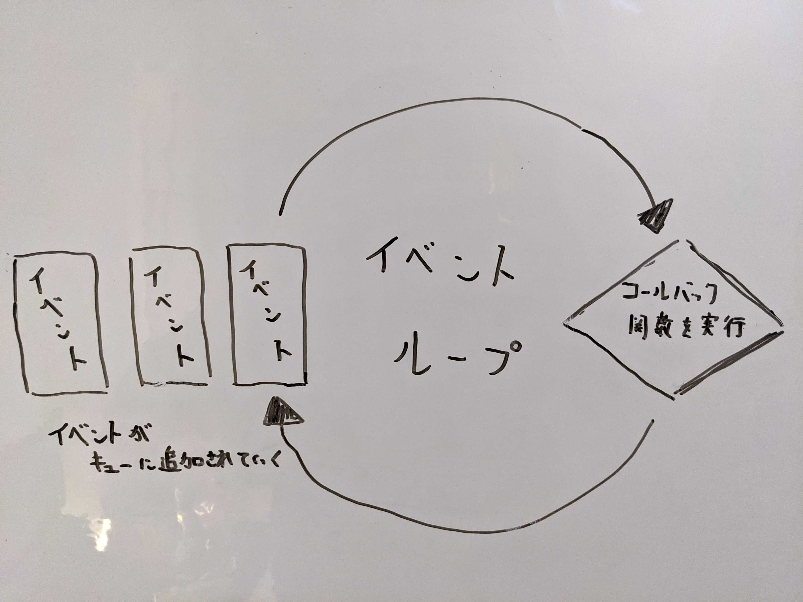
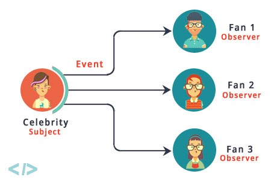

<!-- _class: invert -->
<!-- _paginate: false -->

# イベント駆動型プログラミングについて

### みんなのPython勉強会 #74

#### 2021/10/13 | Masataka Arai


----

## お前誰よ?


* Masataka Arai [@massa142][1]
* [SQUEEZE Inc.][2]
* [Pythonもくもく会][3] 主催
* [Python Boot Camp][4] 講師

[1]: http://massa142.github.io/
[2]: https://squeeze-inc.co.jp/
[3]: https://mokupy.connpass.com/
[4]: https://www.pycon.jp/support/bootcamp.html

----

## 宣伝！

----


----

* [@iktakahiro](https://twitter.com/iktakahiro) とポッドキャスト最近はじめました
* 次回は @iktakahiro が、PyCon JP 2021で登壇した直後に収録！
  * 熱い登壇後記を話す予定です
  * connpassでもイベント立てるので、みんな参加してねー
* [2021.10.14 『コードと文学』第6夜 - Show note](https://iktakahiro.notion.site/2021-10-14-6-Show-note-7c8e4a96d6154ba593ed13212c71709a)


----

今日はイベント駆動型プログラミングについて、ざっと話そうと思います。

----

## 目次

* イベント駆動型プログラミングとは
* イベント駆動型プログラミングの3パターン
  * Callback
  * Subject
  * Topic
* イベント駆動型アーキテクチャへ

----

<!-- _class: invert -->

## イベント駆動型プログラミングとは

---

* 上から下に順に処理が実行される（手続き型プログラミング）のではなく、
* 特定のイベントが発生したら処理を実行してねっていう手法

---

* GUIだとユーザーの操作・入力はすべてイベントなので、フロントエンドでは必ず必要になってくる
* フロントエンドだけでじゃなくて、DBのトリガもイベント駆動型の一種
  * トリガ: あるテーブルにINSERTやUPDATE、DELETE文を実行したタイミングで、ストアドプロシージャを呼び出す機能
* というわけで、バックエンドでもよく使うやり方だよ

---

<!-- _class: invert -->

## イベント駆動型プログラミングの3パターン

---

<!-- _class: invert -->

## 1. Callback

---

### Callback

* イベントに対する処理 (コールバック関数) を実装して、あらかじめ登録しておく
* そのイベントが発生したら、コールバック関数が呼び出される

※ イベントループがイベントの監視と、コールバック関数への振り分けをしている


---

### イメージ図




---

### JavaScriptでの例

```js
setTimeout(() => {
  alert('#stapy')
}, 1000);
```
---

### 特徴

* シンプルでわかりやすい！
* 1つのイベントに紐付けられるコールバック関数は1つだけ

---

<!-- _class: invert -->

## 2. Subject

---

### Subject

* Subjectが発生させるイベントを、複数のObserverが購読する

---

### イメージ図



Ref: [Observer Pattern in Java. “Life was always a matter of waiting… | by Arjun Sunil Kumar](https://arjunsk.medium.com/observer-pattern-in-java-43e464249bed)

---

### 特徴

* Callbackと違って、複数のイベントハンドラを登録できる
* Subjectが発生させるすべてのイベントがObserverに通知される
  * Observerが欲しいイベントをフィルタリングする or
  * イベントの種類ごとにSubjectを分ける
  * 大規模になると、複雑にはなる
* Callbackよりも疎結合で、次に紹介するTopicよりも密結合
  * 個人的には、ロジックを把握しやすいのでメインとなるロジックに適用するのがおすすめ

---

<!-- _class: invert -->

## 3. Topic

---

### Topic

* イベントの定義からはじまる
* イベントを発生させる存在がなくても、そのイベントを購読可能
* だれも購読してないイベントを発生可能
* イベントが、発生する側・購読する側に依存してない

※ このイベントのことは、トピックと呼ばれたりシグナルと呼ばれたりします（ややかしいですね！
※ Django, Flask, Scrapyなどはシグナルという用語を使ってる

---

### Djangoでの例

```py
from django.db.models.signals import post_save
from django.dispatch import receiver
from django.core.mail import send_mail

from .models import User


@receiver(post_save, sender=User)
def send_registered_mail_handler(sender, instance, created, **kwargs):
    if created:
        send_mail('タイトル', '本文',　'no-reply@massa142.com', [instance.email])
```

---

### 特徴

* 発生する側・購読する側が疎結合なので、イベントの種類を細かく分割して設計しやすい
* 疎結合すぎる面もあるので、知らないうちにイベントを購読していて処理が実行されているということも起こりがち
  * 個人的には、メインロジックではなく補助的な処理を書くのがおすすめ

---

<!-- _class: invert -->

## イベント駆動型アーキテクチャへ

---

* イベント駆動型プログラミングは、アプリケーションの部品を分解して、部品間のやり取りをイベントでやっている
* この分解のスコープを広げて、やり取りをネットワーク越しにするようになったのがイベント駆動アーキテクチャ

---

### メリット

* 時間がかかる処理などを非同期に逃がせる
  * HTTPリクエストをより多く処理できるように
* 処理を分散できるので、スケールがしやすい
* エラーが発生してもリトライできるので、復元力の高いシステムに


### デメリット

* アーキテクチャが複雑になる
* 監視・ログなどの考えごとが増える
* 処理の遅延が大きくなりうる

---

イベント駆動アーキテクチャ・非同期タスクについては、DjangoCongress JP 2021で話したので、詳しくはこちらをどうぞ！

[Django & Celery in production - Speaker Deck](https://speakerdeck.com/massa142/django-and-celery-in-production)


---


<!-- _class: invert -->

## おわりに

---

* イベント駆動型プログラミングには3つのパターンがあるよ
  * Callback・Subject・Topic
  * それぞれメリット・デメリットがあるから、用法用量を守って使っていきましょう :pill:
* イベント駆動型プログラミングの発展として、イベント駆動アーキテクチャも見てみよう :eyes:

---

## 参考文献

* [エキスパートPythonプログラミング 改訂3版](https://www.kadokawa.co.jp/product/302105001236/)
  * 第16章「イベント駆動型プログラミング」

---

ご静聴ありがとうございました 😊
