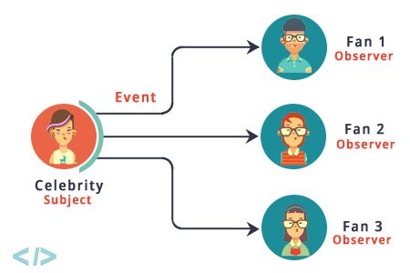
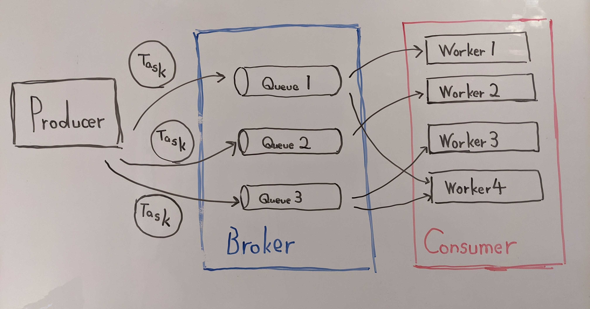

<!-- _class: invert -->
<!-- _paginate: false -->

# イベント駆動アーキテクチャについて

### PyCon JP 2022

#### 2022/10/14 | Masataka Arai


----

## お前誰よ?


* Masataka Arai [@massa142][1]
* [SQUEEZE Inc.][2] CPO
* [Pythonもくもく会][3] 主催
* [Python Boot Camp][4] 講師

[1]: http://massa142.github.io/
[2]: https://squeeze-inc.co.jp/
[3]: https://mokupy.connpass.com/
[4]: https://www.pycon.jp/support/bootcamp.html

----

今日はイベント駆動型プログラミング について説明した後に、
Django x Celeryなイベント駆動のアーキテクチャの本番運用Tipsをご紹介します。

----

今回扱わないこと

* Celeryの初期設定まわり
* インフラ構成
* Celery利用以外のアーキテクチャ
  * マイクロサービス
  * サーバーレス
  * etc.

----

## 目次

* イベント駆動型プログラミングの3パターン
  * Callback
  * Subject
  * Topic
* イベント駆動アーキテクチャへ
* タスクキューとは
* Celeryの基本Tips
* リトライ設計
* ログ保存
* 監視
* デプロイ戦略

----

<!-- _class: invert -->

## イベント駆動型プログラミングとは

---

* 上から下に順に処理が実行される（手続き型プログラミング）のではなく、
* 特定のイベントが発生したら処理を実行してねという手法

---

* GUIだとユーザーの操作・入力はすべてイベントなので、フロントエンドでは必ず必要になってくる
* フロントエンドだけでじゃなくて、DBのトリガーもイベント駆動型の一種
  * トリガー: あるテーブルにINSERTやUPDATE、DELETE文を実行したタイミングで、ストアドプロシージャを呼び出す機能
* フロントエンドだけじゃなくサーバーサイドでも抑えておきましょう

---

<!-- _class: invert -->

## イベント駆動型プログラミングの3パターン

----

## イベント駆動型プログラミングの3パターン

1. Callback
2. Subject
3. Topic


参照: [「エキスパートPythonプログラミング 改訂3版」第16章 イベント駆動型プログラミング](https://www.kadokawa.co.jp/product/302105001236/)

----

<!-- _class: invert -->

## 1. Callback

---

### Callback

* イベントエミッターがイベント発生時に実行される処理を、あらかじめ定義しておく
* そのイベントが発生したら、コールバック関数が呼び出される


---

### HTML/JavaScriptでの例

```html
<input type="button" value="1" onclick="log()">
```

```html
<script>
function log() {
  console.log("PyCon JP 2022");
}
</script>
```

---

### 特徴

* シンプルでわかりやすい！
* 1つのイベントに紐付けられるコールバック関数は1つだけ
* 1:1の紐付けなので、密結合になり汎用的に定義しづらい :thinking:

---

<!-- _class: invert -->

## 2. Subject

---

### Subject

* イベントエミッター(Subject)が発生させるイベントを、複数のObserverが購読する

---

### イメージ図



Ref: [Observer Pattern in Java. “Life was always a matter of waiting… | by Arjun Sunil Kumar](https://arjunsk.medium.com/observer-pattern-in-java-43e464249bed)

---

### 特徴

* デザインパターンのObserverパターン
* Callbackと違って、複数のイベントハンドラを登録できる
* Subjectが発生させるすべてのイベントがObserverに通知される
  * Observerが欲しいイベントをフィルタリングする or
  * イベントの種類ごとにSubjectを分ける
  * 大規模になると、複雑にはなる
* Callbackよりも疎結合で、次に紹介するTopicよりも密結合
  * 個人的には、ロジックを把握しやすいのでメインとなるロジックに適用するのがおすすめ:bulb:

---

<!-- _class: invert -->

## 3. Topic

---

### Topic

* イベントの定義からはじまる
* イベントを発生させる存在がなくても、そのイベントを購読可能
  * だれも購読してないイベントも発生可能
* イベントが、発生する側・購読する側に依存してない

※ このイベントのことは、トピックと呼ばれたりシグナルと呼ばれたりします
※ Django, Flask, Scrapyなどはシグナルという用語を使ってる :eyes:

---

### Djangoでの例

```py
from django.db.models.signals import post_save
from django.dispatch import receiver
from django.core.mail import send_mail

from .models import User


@receiver(post_save, sender=User)
def send_registered_mail_handler(sender, instance, created, **kwargs):
    if created:
        send_mail('タイトル', '本文',　'no-reply@massa142.com', [instance.email])
```

---

### 特徴

* 発生させる側・購読する側が疎結合なので、イベントの種類を細かく分割して設計しやすい
* 疎結合すぎる面もあるので、知らないうちにイベントを購読していて処理が実行されているということも起こりうるので注意
* このパターンの延長線として、イベント駆動アーキテクチャへ :railway_car:

---

<!-- _class: invert -->

## イベント駆動アーキテクチャへ

---

* イベント駆動型プログラミングは、アプリケーションの部品を分解して、部品間のやり取りをイベントでやっている
* この分解のスコープを広げて、やり取りをネットワーク越しにするようになったのがイベント駆動アーキテクチャ
  * このあとCeleryを使った設計について解説していきます
  * サーバーレスにアプリケーションを分離できるなら、 AWS Lambda x SQSのようなFaaS構成
  * マイクロサービスな設計を採用するなら、Kafkaのようなイベントストリーミングを利用する場合も

----

### メリット

* 処理を分散できるので、スケールがしやすい
* 疎結合にできるので、アップデートがしやすい
* 時間がかかる処理などを非同期に逃がせる
  * HTTPリクエストをより多く処理できるように
* エラーが発生してもリトライできるので、復元力の高いシステムに


### デメリット

* アーキテクチャが複雑になる
* 監視・ログなどの考えごとが増える
* 処理の遅延が大きくなりうる

##### => 用法・用量を守って使っていこう :pill:

----

### 使い所

* メール送信
* ファイル処理
* 外部からWebhookを受信する場合レスポンスはすべて200で返して、内部処理をタスクキューに流す
  * アプリケーションロジックのバグで、Webhook受信が失敗しないように
* 同期性が必要なく、ユーザーにはやくレスポンスを返したい

----

<!-- _class: invert -->

## タスクキューとは

---

### 概念図



---

### 用語集

* **Task**: 非同期で実行させる処理のまとまり

* **Queue**: Taskを格納する入れもの (FIFO: First-In-First-Out)

* **Producer**: Taskを作成してBrokerに渡す (Celeryだと「Celery Client」がこの役割)

* **Broker**: 作成されたTaskをQueueに登録したり、Queueに登録されているTaskをConsumerに渡す

* **Consumer**: BrokerによってQueueから取り出されたTaskを実際に処理する (Celeryだと「Celery Woker」がこの役割)

----

### 他の選択肢

* RQ
  * 「Simple job queues for Python」と謳っているとおりシンプルで扱いやすい
  * 対応しているBrokerはRedisのみ

* Apache Kafka
  * 分散メッセージングシステム
  * タスクに含まれるデータを時系列情報として永続化
  * タスクを取り出しても廃棄されないので、複数のマイクロサービスなどから参照ができて便利
  
----

### Celeryの対応Broker

|  Name  |  Status  |　Monitoring | Remote Control | 
| ---- | ---- | ---- | ---- |
|  RabbitMQ  |  Stable  | Yes | Yes |
|  Redis  |  Stable  | Yes | Yes |
|  Amazon SQS  |  Stable  | No | No |
|  Zookeeper  |  Experimental  | No | No |

参照: [Backends and Brokers — Celery 5.1.2 documentation](https://docs.celeryproject.org/en/stable/getting-started/backends-and-brokers/index.html)

---

<!-- _class: invert -->

## Celeryの基本Tips

---

### Taskの処理は短く

* 理解しやすいように、責務をシンプルに
  * アーキテクチャが複雑になっているので、処理自体は簡潔に
* リトライしやすいように、ステートレスでアトミックな処理
  * リトライについては、あとで詳しく話します :pray:
---

### プリミティブな値を渡す

* Taskの引数には、複雑なオブジェクトを渡さずに、intやstrなどのプリミティブな値を渡す
* とくにDjangoなどでモデルインスタンスは渡しがちなので注意 :warning:
  * シリアライザーのデフォルト設定 json のままだと、`TypeError` 発生
    * シリアライザーにpickleを設定すれば、渡すことはできる
  * 非同期なのでCelery Workerが処理を開始する前にこのレコードが更新されてしまうと、古い状態のままのデータを使ってしまうことに

参照: [95:Celeryのタスクにはプリミティブなデータを渡そう — 自走プログラマー【抜粋版】](https://jisou-programmer.beproud.jp/%E3%83%97%E3%83%AD%E3%82%BB%E3%82%B9%E8%A8%AD%E8%A8%88/95-Celery%E3%81%AE%E3%82%BF%E3%82%B9%E3%82%AF%E3%81%AB%E3%81%AF%E3%83%97%E3%83%AA%E3%83%9F%E3%83%86%E3%82%A3%E3%83%96%E3%81%AA%E3%83%87%E3%83%BC%E3%82%BF%E3%82%92%E6%B8%A1%E3%81%9D%E3%81%86.html)

---

シリアライズに失敗

```py

>>> user = User.objects.get(pk=user_id)
>>> sample_task.delay(user=user)
Traceback (most recent call last):
...
TypeError: Object of type 'User' is not JSON serializable
```

id を渡して、Taskのなかで最新のデータを取得するように

```py

@shared_task
def smaple_task(user_id):
    if not user_id:
        return
    
    user = User.objects.get(pk=user_id)
    ...
    user.save()
```

---

### テストでは always_eager をTrueに

* Djangoでは `CELERY_ALWAYS_EAGER = True` を設定すると、Taskは同期的に実行されるので、Celery Workerを起動しなくても :ok:

* テストやローカル開発時には、この設定にしておくと捗る


---


<!-- _class: invert -->

## リトライ設計

---

### そもそもの例外設計

* 復帰可能なエラーのみキャッチする
* 復帰可能なエラー以外は、 握りつぶさず投げっぱなしにする
  * 最上位層で復帰できない例外として処理する
  * そこでSentryなどの Error Tracking Software に飛ばす


参照: https://gist.github.com/sunaot/6138546#%E4%BE%8B%E5%A4%96%E8%A8%AD%E8%A8%88%E3%81%AE%E8%A9%B1

---

### リトライ設計

* 復帰可能なエラーはリトライし続ける
  * 設定した最大リトライ回数まで
* 処理はステートレスで設計する
* 処理の冪等性を担保しておく
  * 基本的には transaction.atomic で
* 1回の大きな処理よりも複数の小さな処理に分割しておく


---

### リトライ設計

* 障害の回避が目的ではなく、ダウンタイムやデータ損失を回避すべく障害に対応していく
* 復旧が遅くなればなるほど、確認事項が増えて自動化が困難
* 「壊れない」から、「素早くいつでも回復できる」設計へ

参照: [15分で分かる NoOps](https://www.slideshare.net/hiromasaoka/15-noops)

---

### リトライ関連の設定

* autoretry_for
  * 自動リトライ対象のExeptionクラスを指定
* max_retries
  * 最大リトライ回数
* retry_backoff
  * `Exponential backoff` を有効に
  * リトライ間隔を指数関数的に増加（例: 1秒後、2秒後、4秒後、8秒後、、、
* retry_backoff_max
  * `retry_backoff` 有効時の最大リトライ間隔
* retry_jitter
  * `retry_backoff` 有効時に、jitter（ゆらぎ）を導入
  * リトライ実行タイミングの衝突を回避するため

---

### リトライ関連の設定

* time_limit
  * ハードタイムリミット
  * このタイムリミットを超えたら、Taskを実行しているWorkerがkillされて、新しいWorkerに置き換わる :knife:
* soft_time_limit
  * ソフトタイムリミット
  * このタイムリミットを超えたら、`SoftTimeLimitExceeded` がraiseされる
  * ハードタイムリミットになる前に、アプリケーション側で制御が可能

---

復帰可能のハンドリングが簡単であれば、`autoretry_for` の設定でOK

```py
@celery_app.task(
    bind=True,
    soft_time_limit=60,
    time_limit=120,
    autoretry_for=(RetryableException,),
    retry_kwargs={'max_retries': 10},
)
def example_task(
    self,
    user_id=None,
    **kwargs,
):
    ...
```

---

復帰可能なエラーのパターンが増えてきたら、リトライ用のdecoratorを自作して育てていくのがよき

```py
@celery_app.task(
    bind=True,
    soft_time_limit=60,
    time_limit=120,
    retry_kwargs={'max_retries': 10},
)
@retry_when_retryable(logger=logger)
def example_task(
    self,
    user_id=None,
    **kwargs,
):
    ...
```

---

```py
def retry_when_retryable(logger=None):  # noqa C901 That's too complex :(
    if not logger:
        logger = _logger

    def _retry_when_retryable(task):
        @functools.wraps(task)
        def wrapper(app, *args, **kwargs):
            try:
                return task(app, *args, **kwargs)
            except DjangoDBOperationalError as exc:
                # Retryable mysql errors
                if exc.args[0] in [
                    1040,  # Too many connections
                    2003,  # Can't connect to MySQL server
                    2013,  # Lost connection to MySQL server during query
                ]:
                    countdown = 60 * 5
                elif exc.args[0] in [
                        1205,  # Lock wait timeout exceeded; try restarting transaction
                        1213,  # Deadlock found when trying to get lock; try restarting transaction
                ]:
                    countdown = 25
                else:
                    raise exc
                logger.warning('Database operation occurred: %s', exc)
                raise app.retry(countdown=countdown, exc=exc)
            except (
                    DjangoDBInternalError,
                    DjangoDBIntegrityError,
            ) as exc:
                # Retryable mysql errors
                if exc.args[0] in [
                    1062,  # Duplicate entry (when get_or_create)
                    1206,  # The total number of locks exceeds the lock table size
                    1689,  # Wait on a lock was aborted due to a pending exclusive lock
                ]:
                    logger.warning('Database internal occurred: %s', exc)
                    raise app.retry(countdown=25, exc=exc)
                raise exc
            except CelerySoftTimeLimitExceeded as exc:
                logger.info('Time limit occurred: %s', exc)
                raise app.retry(countdown=60 * 5, exc=exc)
            except RetryableException as exc:
                logger.warning('Retryable error occurred: %s', exc)
                raise app.retry(countdown=exc.countdown, exc=exc)

        return wrapper

    return _retry_when_retryable
```

https://gist.github.com/massa142/d9256496469c8e95f526d2132fab9426

---

<!-- _class: invert -->

## ログ保存

---

### django-celery-results

* Taskの実行結果をDBに保存してくれる
  * キャッシュバックエンドに保存するように設定も可能
* なにかあったときに、あとから運用でカバーできるように

---

### テーブル構造

```
mysql> desc django_celery_results_taskresult;
+--------------------+--------------+------+-----+---------+----------------+
| Field              | Type         | Null | Key | Default | Extra          |
+--------------------+--------------+------+-----+---------+----------------+
| id                 | int(11)      | NO   | PRI | NULL    | auto_increment |
| task_id            | varchar(255) | NO   | UNI | NULL    |                |
| status             | varchar(50)  | NO   | MUL | NULL    |                |
| content_type       | varchar(128) | NO   |     | NULL    |                |
| content_encoding   | varchar(64)  | NO   |     | NULL    |                |
| result             | longtext     | YES  |     | NULL    |                |
| date_done          | datetime(6)  | NO   | MUL | NULL    |                |
| traceback          | longtext     | YES  |     | NULL    |                |
| meta               | longtext     | YES  |     | NULL    |                |
| task_args          | longtext     | YES  |     | NULL    |                |
| task_kwargs        | longtext     | YES  |     | NULL    |                |
| task_name          | varchar(255) | YES  | MUL | NULL    |                |
| worker             | varchar(100) | YES  | MUL | NULL    |                |
| date_created       | datetime(6)  | NO   | MUL | NULL    |                |
| periodic_task_name | varchar(255) | YES  |     | NULL    |                |
+--------------------+--------------+------+-----+---------+----------------+
15 rows in set (0.00 sec)

mysql>
```

---

## 運用でカバー

### 具体例

HTTPリクエスト先が500エラーを返しきて、Celery Taskが異常終了していた

### アプローチ

Dango adminから異常終了した(status=FAILED)のTaskを期間指定で絞りこんで、まとめてリトライするようなaction用意しておくと便利
  * HTTPリクエスト先が復旧した後で、このactionを実行する
  * task_name, task_args, task_kwargsが保存されているので、そこから再実行可能

---

<!-- _class: invert -->

## 監視

---

* django-celery-resultsを使えば実行ログを保存できるので、Celery Workerが受け取ったTask状況は確認できるけど、、、
* Queueがどれくらい詰まっているかなどはわからない


##### => 監視が必要に :eyes:

---

### Flower

* Task状況が可視化されて便利 💐
* ローカル開発のときにありがたい
* `$ flower -A proj --port=5555`


---

本番環境だとDatadogなどで監視するのがよいけれど、`celery inspect` コマンドを使った簡易的な監視Scriptでも頑張ることもできる

* `$ celery -A proj inspect reserved`
  * Workerが取得したけど、実行待ちになっているTaskを列挙
* これを使って、ずっと実行待ちになっているTaskがないかをチェック 

----

`$ celery -A proj inspect reserved --json | check_celery_reserved.py 300 /tmp/celery_reserved_jobs`

```py
def check():
    recs = json.load(sys.stdin)

    prev = {}
    cur = {}

    save = pathlib.Path(args.save)
    if save.exists():
        try:
            prev = json.loads(save.read_text())
        except Exception as e:
            print(e, file=sys.stderr)

    for worker, jobs in recs.items():
        for job in jobs:
            jobid = job.get('id', '')
            if not jobid:
                continue
            cur[jobid] = prev.get(jobid, now)

    try:
        save.write_text(json.dumps(cur))
    except Exception as e:
        print(e, file=sys.stderr)

    for job, t in cur.items():
        d = now - t
        if d >= args.secs:
            # Slack通知


if __name__ == '__main__':
    check()
```


----

<!-- _class: invert -->

## デプロイ戦略

----

### 既存Taskを拡張する

Taskは引数変更したものをデプロイした後も、しばらく旧引数で呼び出される可能性あり。いつでも引数の増減が可能なように最初から

* 引数はすべてキーワード引数渡しで
* `**kwargs` を追加しておく

と、デプロイタイミングに慎重になることもなく運用がしやすい :relaxed:

----

変更前
```py
@app.task
def change_kwargs_task(current=None, **kwargs):  # Old
   ...
```

変更後
```py
@app.task
def change_kwargs_task(current=None, new=None, **kwargs):  # New
   new = new or some_calc(old)
   if not new:
      logger.warning('Warning!')
      return True
   ...
```

----

### 既存Taskを削除する

さっきのと同様にWorker側から削除したあとでも、デプロイタイミングによってはそのTaskが呼び出される可能性あり。

まずは削除せずdeprecatedにして、そのTaskが呼ばれなくなったことを確認できてから別リリースで削除すれば :ok:

---

<!-- _class: invert -->

## おわりに

---

* 今日話したことはだいたいCeleryの公式ドキュメントに載ってます :book:
  * まだまだ日本語の情報・知見が充実していないかなと思うので、この発表がどこかで役に立てばいいな
* Celeryを使うことで、ユーザーへのレスポンスがはやい & なにかエラーになってもリトライ可能な復元力が高い サービスにしていきましょう :100:


---

ご静聴ありがとうございました 😊

---

<!-- _class: invert -->

## 時間があまったら

---

### 重い処理するときの注意点

#### 時間がかかる場合

* 時間がかかる処理専用のQueueに分ける
  * そのQueueを購読する専用のWorkerを立ちあげる
* `CELERYD_PREFETCH_MULTIPLIER` を 1 に
  * WorkerがBrokerから一度に取得するTask数
  * 通信コストを抑えるためにデフォルト値は 4
  * WorkerがTaskを取得したあとに詰まらないようにするために 1 をセット


#### メモリリークケア
* `CELERY_WORKER_MAX_TASKS_PER_CHILD` を 1 に
  * Workerが同じプロセスで実行する最大Task数
  * 1にセットしたら、Taskごとに新しいプロセスが生成される

---

<!-- _class: invert -->

## ワークフローデザイン

---

### ワークフロー

* Celeryは非同期実行だけじゃなくて、ワークフローを組むこともできる
* 直列・並列・展開を組み合わせて、処理をかけあわしていく

### 簡単なイメージ


---

### Chain

```py
>>> from celery import chain
>>> from proj.tasks import add, mul

>>> # (4 + 4) * 8 * 10
>>> res = chain(add.s(4, 4), mul.s(8), mul.s(10))()
>>> res.get()
640
```

* タスクを直列に（順番に）実行する
* 前のタスクの実行結果が、後ろのタスクの第1引数に渡される

---

### Signature

* `add.s(4, 4)`は、`add.signature(4, 4)` のショートカット記法
* signatureを利用するとタスクに渡された引数や実行オプションをラップすることができて、他の関数に渡すことができる

### Immutable signature

* 前のタスクの実行結果が必要ない場合は、immutableなsignatureにできる

* `add.signature((2, 2), immutable=True)`で、ショートカット記法は `add.si(2, 2)`

---

Immutable sigunatureを使うと、それぞれ独立したTaskを指定した順番で実行できるようになる :bulb:

```py
>>> res = (add.si(2, 2) | add.si(4, 4) | add.si(8, 8))()
>>> res.get()
16
```

Chainの他にも

* 複数のTaskを並列に実行するGroup
* 複数のTaskの実行結果をコールバックに渡すことができるChord

などがある。

参照: [Canvas: Designing Work-flows — Celery 5.1.2 documentation](https://docs.celeryproject.org/en/latest/userguide/canvas.html)
